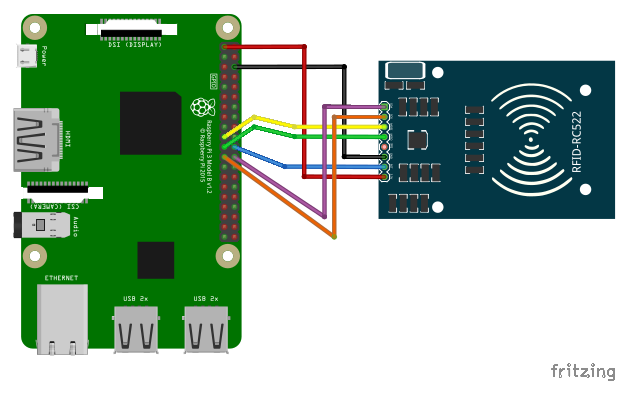
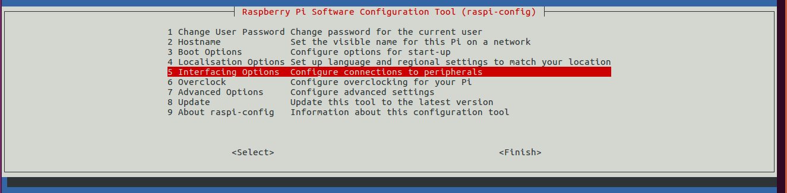
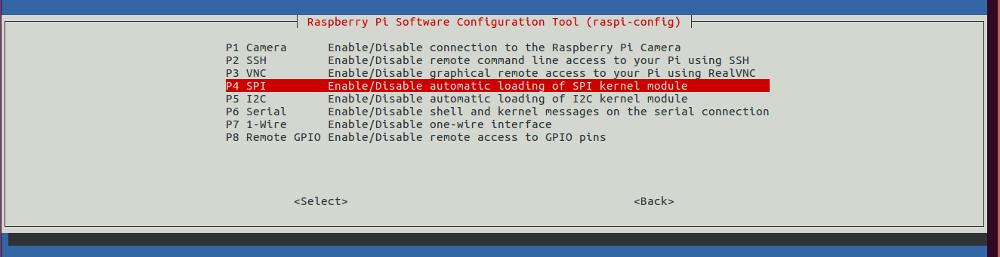
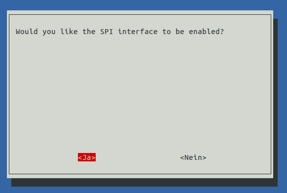
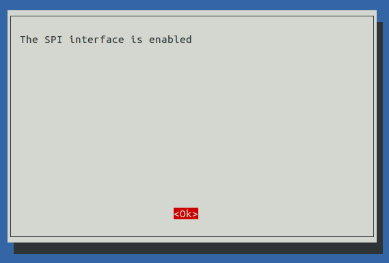
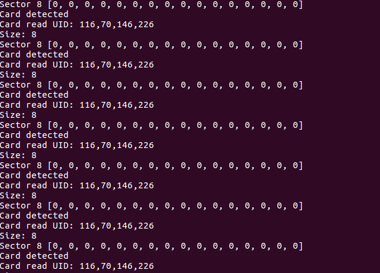

# Raspberry Pi & RFID mit dem Sensormodul vom Typ RC522

## Material
+ Raspberry Pi
+ Mifare RC522 RFID Modul (inkl. KeyCard)
+ 7 Female – Female Kabel

## Aufbau

Bei meinem Sensormodul war die Pin-Leiste noch nicht angelötet.
Das Löten muss im Vorfeld geschehen, sonst können die Pins nicht verbunden werden.



| RFID Sensormodul | GPIO Pin        |
|------------------|-----------------|
| SDA              | GPIO8           |
| SCK              | GPIO11          |
| MOSI             | GPIO10          |
| MISO             | GPIO9           |
| IRQ              | nicht verbunden |
| GND              | Ground          |
| RST              | GPIO25          |
| 3.3V             | 3V3             |

## Vorbereitung
```
sudo apt-get update
sudo apt-get upgrade
sudo apt-get install python-dev git
```

Aktiviere den SPI Bus über die Config-Oberfläche: `sudo raspi-config`









Starte danach zur Sicherheit das System neu (Reboot).

## MFRC522-Python-Modul

Das MFRC522-Python-Modul verwendet das folgende Python SPI Modul. Das Python SPI Modul muss zuerst installieren werden:

```
git clone https://github.com/lthiery/SPI-Py.git
cd SPI-Py
sudo python setup.py install
```


Im Anschluss können wir das MFRC522-Python-Modul für den Raspberry Pi installieren:

```
git clone https://github.com/mxgxw/MFRC522-python.git && cd MFRC522-python
```

### Raspberry Pi RFID Reader testen
Zum RC522 Modul werden meistens eine weiße Karte sowie ein NFC fähiger Schlüsselanhänger geliefert.

Für einen ersten Test starten wir das erste Beispiel:

python Read.py

Sobald die Chipkarte über die Sensorfläche gehalten wird und erkannt wird, sieht man eine Ausgabe wie die folgende:


